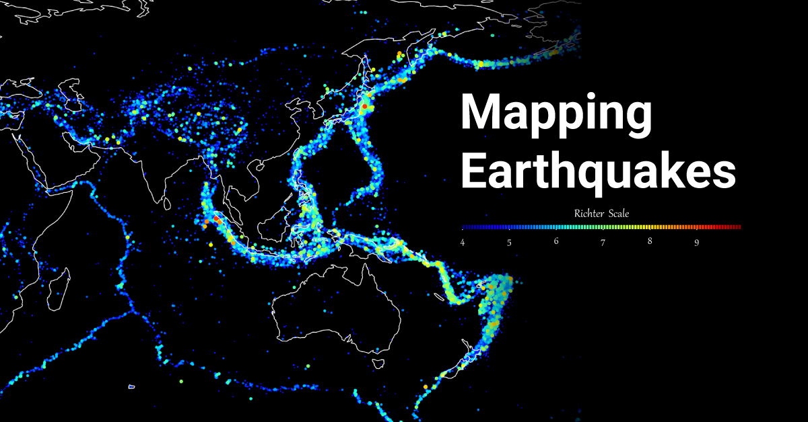
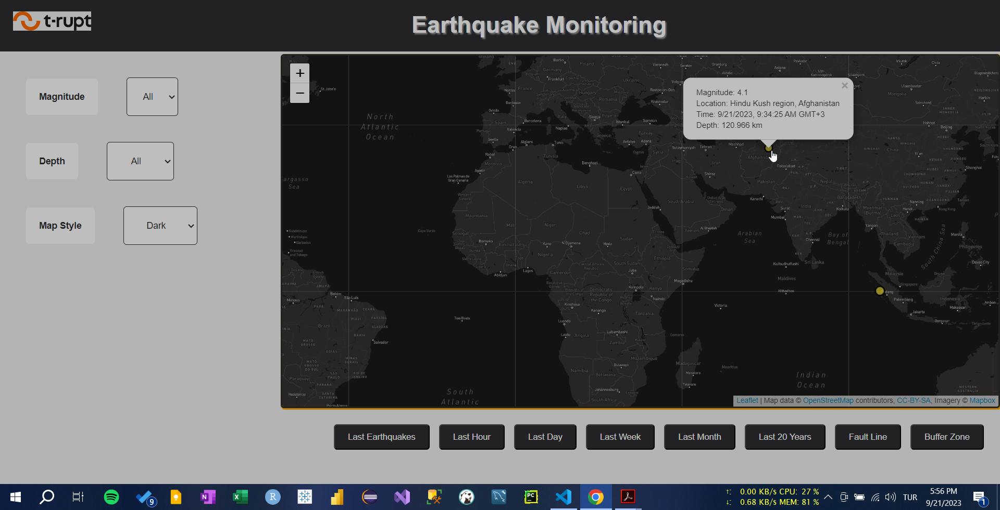
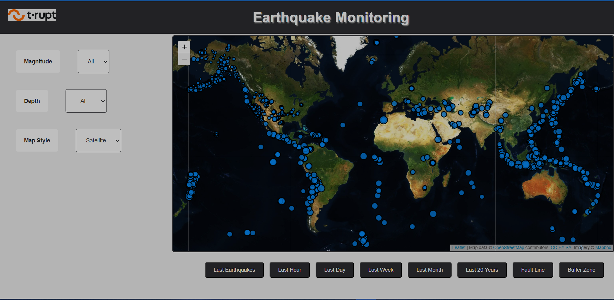
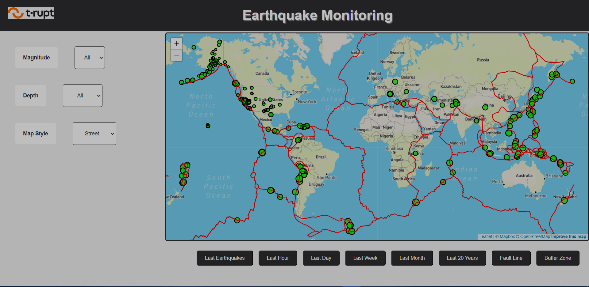

# Real-Time-Earthquake-Mapper

Real Time Earthquake Mapper is a web application that empowers users to explore and visualize up-to-date earthquake data in real-time, offering valuable insights into seismic activity worldwide. This interactive mapping tool leverages cutting-edge technologies to provide an intuitive and informative experience for users interested in monitoring and analyzing earthquakes.

## Table of Contents

- [Demo](#demo)
- [Features](#features)
- [Technologies](#technologies)
- [Installation](#installation)
- [Usage](#usage)
- [Screenshots](#screenshots)
- [Contributing](#contributing)
- [License](#license)

## Demo

Watch a demonstration of the Real Time Earthquake Mapper in action: [Demo Video](imgs/22.09.2023_10.30.42_REC.mp4)
## Features

- **Real-Time Data**: The application fetches earthquake data in real-time from the United States Geological Survey (USGS) API, ensuring that users have access to the latest seismic information.

- **Advanced Filtering**: Users can customize their earthquake exploration experience with a range of powerful filters, including magnitude, location, and time frame. This enables users to focus on earthquakes that are most relevant to their interests and research.

- **Map Styles**: Choose from a selection of map styles to tailor the visualization to your preferences. Options include default, light, dark, and satellite views, providing flexibility for various use cases.

- **Fault Lines**: Gain deeper insights into tectonic activity by overlaying tectonic fault lines on the map. This feature helps users understand the geological context of earthquakes.

- **Buffer Zone Analysis**: The application includes a buffer zone tool powered by Turf.js, allowing users to generate custom buffer zones around recent earthquakes. This feature is invaluable for assessing potential impact areas.

- **User-Friendly Interface**: The application features an intuitive and user-friendly interface that allows both novice and experienced users to easily navigate and access earthquake data.

## Technologies

- **Frontend Technologies**: The project is built using HTML, CSS, and JavaScript to create an interactive and user-friendly frontend interface.

- **Mapping Library**: Leaflet.js is used for mapping functionality, providing an interactive and customizable map experience.

- **Map Tiles**: OpenStreetMap is the source of map tiles, ensuring high-quality and up-to-date cartography.

- **Geospatial Analysis**: Turf.js is utilized for geospatial analysis tasks, such as buffer zone generation.

- **Data Source**: The United States Geological Survey (USGS) API provides real-time earthquake data, enriching the application with the latest seismic information.
## Installation

* Open index.html in your web browser. You can use live server extention in VScode.
  
## Usage
* Launch the application by opening index.html in your web browser.
* Use the sidebar filters to customize earthquake data based on your preferences.
* Explore the interactive map, and click on earthquake markers to access detailed information.
* Experiment with different map styles, filters, and geospatial analysis tools to gain insights into seismic activity.
# Screenshots

## Contributing
* Contributions are welcome! If you'd like to contribute to this project, please follow these steps:
    1. Fork the repository.
    2. Create a new branch for your feature: git checkout -b feature-name
    3. Commit your changes: git commit -m 'Add new feature'
    4. Push to the branch: git push origin feature-name
    5. Create a pull request.
## Conclusion

* The Real Time Earthquake Mapper represents a significant leap in earthquake data visualization and analysis. By harnessing the power of real-time data, advanced filtering, and interactive mapping, this application provides a valuable tool for researchers, students, emergency responders, and anyone interested in understanding seismic activity.

* With its user-friendly interface, dynamic filtering, and customizable buffer zone analysis, Real Time Earthquake Mapper makes earthquake data accessible and actionable. Whether you're conducting research, assessing earthquake impact, or simply exploring seismic events, this application empowers you to make informed decisions.

* I invite you to contribute to this open-source project and help us continue improving earthquake monitoring and analysis tools.